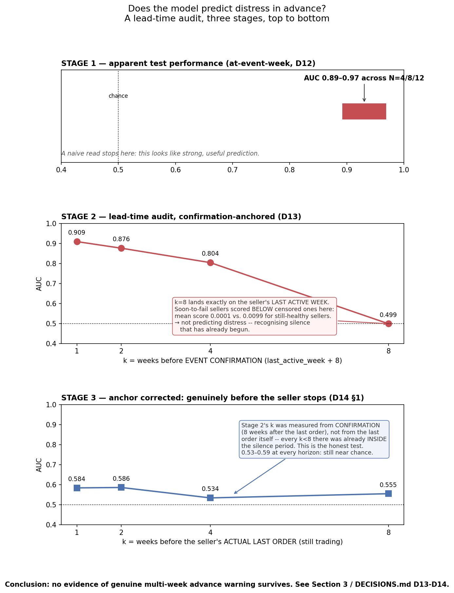
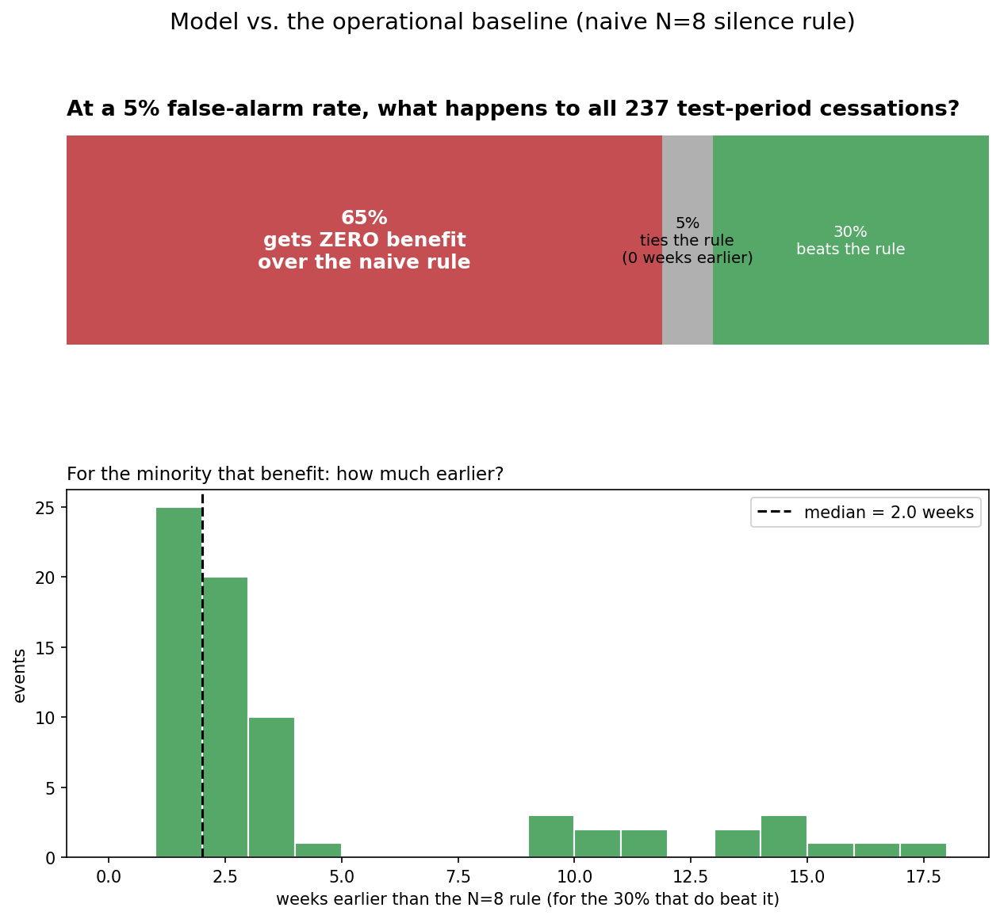
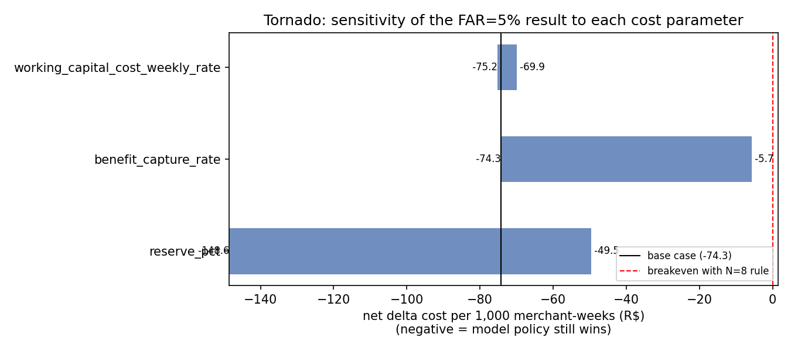
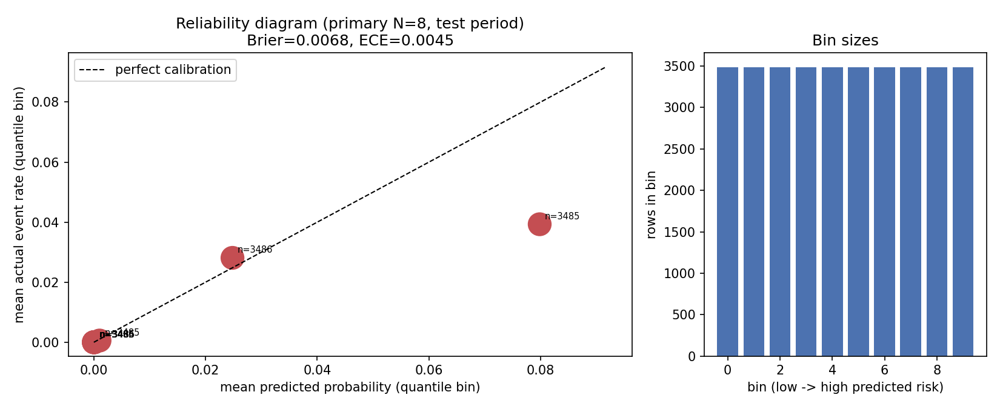
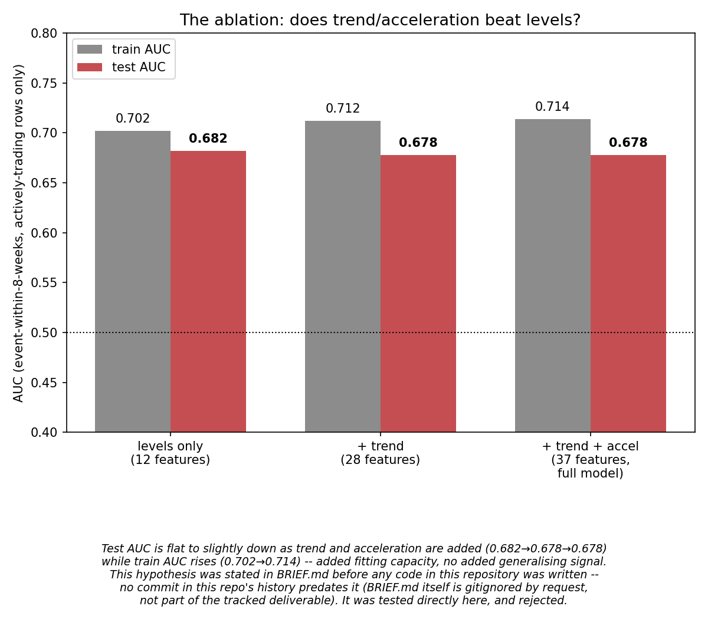
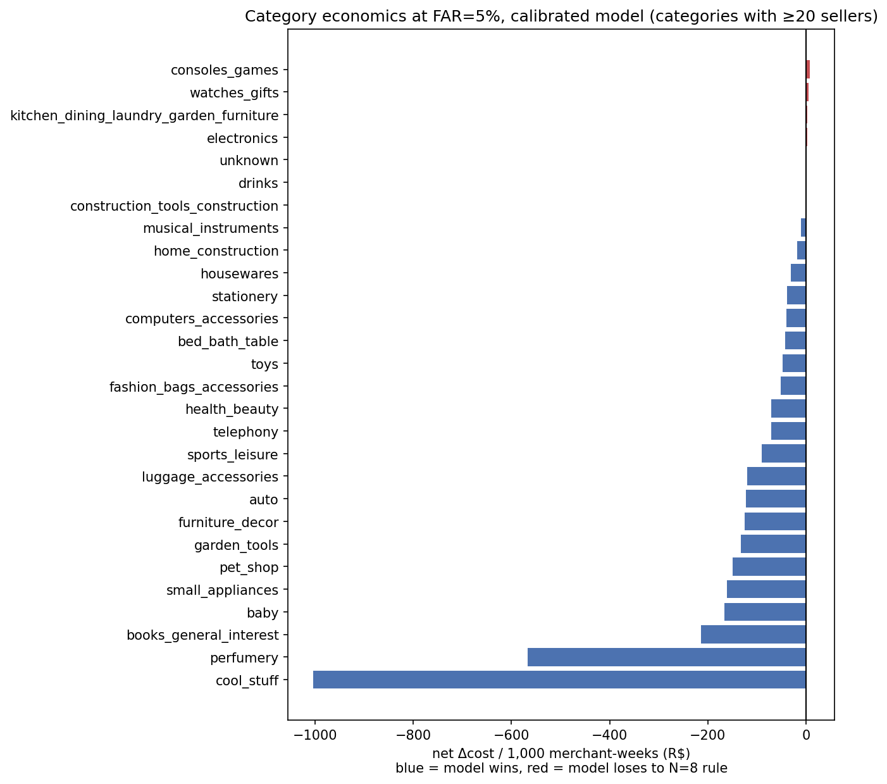

# Merchant Cessation Early-Warning & Reserve Policy Simulation

**One-line summary of where this landed:** the hypothesised mechanism
failed, a simpler one works modestly, and the economic case holds
across every parameter range tested.

Reproduce every number in this document with `./run.sh` (lint, tests,
then every phase's scripts, in order). Individual scripts are documented
in `DECISIONS.md`, referenced by entry number (`D1`, `D17`, …) throughout
this README — that file has the full reasoning behind every choice
mentioned here; `FAILURES.md` has the dead ends, including the ones that
turned out to matter (D14 §3, D21).

**Architecture, end to end:** Olist orders → weekly merchant panel →
leakage-safe features → discrete-time hazard model → isotonic
calibration → FAR threshold → merchant flag → simulated reserve policy →
cost evaluation.

## 1. The problem

This project's loss category is merchant default — the same family as
fraud, chargebacks, and returns, approached from the other side of the
ledger: it is what happens when a merchant collects payment and then
fails to deliver. The refund and chargeback liability that follows does
not stay with the merchant; it lands on the aggregator holding the
reserve, which is the exposure this project is trying to price and catch
earlier.

A payment aggregator settles money to merchants before delivery is
confirmed, carrying that credit exposure if the merchant then fails to
deliver, floods refunds, or simply disappears; the standard defence — a
rolling reserve held back from settlement — is currently sized by crude
static rules (flat percentage, category, tenure) with no live signal.
Across the ~20-month sample used here, R$13.5 million of total merchant
GMV passed through the platform; 1,919 of the 3,065 sellers placed enough
orders to be evaluable at all, and of those, 477 went on to a confirmed,
silence-based exit. This
project asks one narrow, falsifiable question: can payment telemetry
alone flag a failing merchant earlier and cheaper than the naive rule
that just watches for eight weeks of silence — and the honest answer,
worked out in full below, is "modestly, and only if you're honest about
what 'modestly' means."

## 2. What this project found — and the limitations to weigh it against

**The headline finding, arrived at through two rounds of self-audit, not
asserted:** a naive read of this project's own model produced AUC
0.89–0.97 — which looks like strong early-warning prediction. Auditing
that number by lead time collapsed it to exactly chance (0.499) at the
point that matters most, because soon-to-fail sellers were scoring
*below* still-healthy ones there — a sign the measurement, not the
model, had a problem. It did: that audit's own k was counted from
confirmation rather than the seller's actual last order, so every point
except one was already inside the silence period it was supposed to
precede. Correcting that and re-anchoring to the seller's real last
order landed the honest result at 0.53–0.59 AUC across every horizon
tested — still near chance (full detail, Section 3). **That process —
an apparent strong result, an audit that overturned it, and a second
flaw found inside the audit itself — is the discipline this document
tries to apply everywhere else too, including in the three limitations
below.**

**1. The distress label is cessation, not default.** It is defined as
eight consecutive silent weeks with no orders, confirmed and never
reversed (`DECISIONS.md` D3–D6) — not a chargeback, a bankruptcy, or a
merchant-reported closure. Checked directly (`src/phase0_benign_exit.py`):
**86.2% of confirmed cessations (411 of 477) show no elevated
cancellation or late-delivery signal beforehand** — no visible quality
collapse, nothing that looks like failure in progress — consistent with
much of this dataset's "distress" being ordinary attrition, not default.
Every number below is about predicting *cessation*; the gap to default
is real and unmeasured here.

**2. The cost-model parameters are assumptions, not measurements.**
`config/costs.yaml`'s three numbers — reserve percentage, weekly
working-capital cost, benefit-capture rate — do not come from data;
Olist has no financing-cost, reserve-program, or write-off record to
check them against. No real reserve was ever held and no real shortfall
was ever avoided anywhere in this document — every R$ figure is what
*would* happen under an assumed cost structure applied to *realised*
outcomes. Picked once, documented, never tuned to reach a target answer
(`DECISIONS.md` D16); Section 4 shows the conclusion survives wide,
generous ranges around them — "robust to a wide range of guesses," not
the same claim as "measured."

**3. This is marketplace fulfilment telemetry, from Brazilian
e-commerce, evaluated for a payment-settlement question in a different
country.** Two gaps stack here, not one. Olist sellers are scored on
delivery and customer satisfaction, not settlement — a fundamentally
different relationship with the platform than a payment aggregator's
merchants have, with different failure modes (fraud, insolvency,
chargeback floods, not fulfilment attrition) and different data
(transaction/settlement signals, not order/delivery telemetry). Layered
on top: this is Brazilian e-commerce data (Olist, 2017–2018) in
Brazilian Real, evaluated for a hypothesis about Indian payments — kept
in R$ deliberately rather than FX-converted, since a conversion would
imply a relevance this data was never collected to support
(`DECISIONS.md` D15, D16). Order patterns, seasonality, refund norms,
and financing costs may differ from Indian payments merchants in ways
this project cannot check.

## 3. The headline lead-time result



The figure above is the whole argument of this section in one image.
**Stage 1** is what a naive read of Section 6's model produces — AUC
0.89–0.97, which looks like strong prediction. **Stage 2** audits that
number by lead time and it collapses to exactly chance (0.499) by 8 weeks
before confirmation — because that k=8 point lands precisely on the
seller's last active week, where soon-to-fail sellers actually scored
*below* still-healthy ones (mean predicted risk 0.0001 vs. 0.0099).
**Stage 3** corrects a flaw in stage 2's own measurement — its k was
counted from confirmation, not from the seller's actual last order, so
every point except k=8 was already inside the silence period, not before
it. Re-anchored to genuinely precede the last order, the result holds at
0.53–0.59 across every horizon tested: still near chance. Full detail
below.

**There is no evidence of genuine multi-week advance warning.** Checked
directly and reported as a negative result, not softened
(`DECISIONS.md` D13, D14 §1): scoring each confirmed cessation at 1, 2, 4, and 8 weeks
*before the seller's actual last order* — i.e. while still genuinely
trading, the fair test of "did we see it coming" — the model's
discrimination sits at 0.53–0.59 AUC at every horizon. Chance is 0.50.
That is not a small early-warning signal fading with distance; it is
close to no signal at any distance tested.

What the model can do is **detect that a seller has already gone quiet**,
and detect it faster than a payments team manually waiting out a fixed
eight-week silence rule would. The honest headline sentence, replacing
"predicts distress N weeks in advance": **at a 5% false-alarm rate,¹ ²
the model beats the naive eight-week silence rule for 36% of cessations,
by a median of 2.0 weeks — and provides no benefit at all over the naive
rule for the other 58%** (the remaining 6% are flagged the same week
the rule fires — neither an early win nor a miss; `DECISIONS.md` D21,
D26, D31). The lead-time distribution is right-skewed with a long tail
out to 17 weeks for a minority of cases, but the median case is a
two-week head start, not the multi-week advance warning the project set
out to find. The 58% figure is not a footnote — it is shown at the top
of the next section, not buried in a caption.

¹ *Row-level: the share of a healthy seller's individual weekly
test-period rows that cross the threshold, not the share of sellers —
one seller contributes many rows, so this is not "5% of merchants get
flagged." The equivalent seller-level rate at this operating point is
19.4% (Section 4's headline table). Every "FAR" figure in this document
is row-level unless labelled otherwise.*

² *This threshold is a quantile of the TEST set's own censored-row
scores, not independently validated. Achieved row-level FAR at it is
**5.9%**, not exactly 5%, because isotonic calibration collapses scores
into ~46 discrete levels (the same tie-plateau mechanism D21/D23
document for precision) and a quantile cut lands on the nearest level,
not an arbitrary target. A threshold chosen from TRAIN data only and
applied unchanged to test achieves **12.0%**, not 5% — a 2.4x transfer
degradation, driven by the row-level event rate itself drifting 0.53%
(train) → 0.68% (test); at its own achieved FAR that TRAIN-derived
threshold beats the rule for 67% of cessations, no benefit for 27%, a
same-week tie for 6%. That is a real deployment caveat, not a better
number to lead with: at matched achieved FAR the two methods give
substantially the same economics (Section 4's matched-FAR table), so
the apparent size of the train-derived "improvement" was a looser
threshold in disguise, not a better method. This document leads with
the TEST-derived threshold throughout; an earlier draft briefly led
with the TRAIN-derived number before that check was run (`DECISIONS.md`
D29–D31; Section 4 has the full numbers).*

*A note on which numbers are which, stated once here and not repeated as
a caveat everywhere below: this 36%/58%/6% split is on the calibrated
model — D21 established calibration as this project's operating
configuration, and this is what the interactive demo (`app.py`) also
reports, so the two agree. The pre-calibration split was 30%/65%/5%
(`DECISIONS.md` D14 §2) — a real, previously-reported number, not wrong,
just measured before calibration; it appears clearly labelled as the
"pre-calibration comparison" in Section 5, where D21's calibration check
is discussed, and nowhere else in this document. The train-derived
transfer-check split (67%/27%/6%, footnote 2) is a robustness finding
about threshold inheritance, not a competing headline — it lives in
Section 4, not here.*

## 4. Economic comparison



This section compares the model-triggered early-reserve policy against
the naive N=8-week silence rule — the rule any baseline would have to
beat, and the one already running today in this problem's
static-reserve framing. The brief's original plan called for four
baselines too (flat reserve, category-based, tenure-based, a binary
classifier with no survival treatment); that comparison was scoped out
this round in favour of finishing the diagnostics above properly
(Section 8 has the follow-up plan).

Swept the row-level false-alarm rate from 1% to 10% and priced both
sides in R$ per 1,000 merchant-weeks, on the calibrated model: **the
model-based policy beats the rule at every false-alarm rate tested**,
and the margin widens as the rate loosens — from -R$16.50/1,000
merchant-weeks at 1% FAR to -R$155.33/1,000 merchant-weeks at 10% FAR
(negative = the model saves money; pre-calibration numbers are in
Section 5, `DECISIONS.md` D21, D26).

| nominal FAR | achieved row-level FAR* | events accelerated | net Δcost / 1,000 merchant-weeks | seller-level FAR |
|---:|---:|---:|---:|---:|
| 1% | 2.5% | 26/237 | -R$16.50 | 11.5% |
| 5% | 5.9% | 85/237 | -R$98.03 | 19.4% |
| 10% | 12.0% | 158/237 | -R$155.33 | 36.9% |

*\*Achieved FAR isn't exactly the nominal target even though the
threshold is a quantile of this exact test population — isotonic
calibration's ~46 discrete levels mean a quantile cut lands on the
nearest one, not an arbitrary target (mechanism in Section 3, footnote
2; `DECISIONS.md` D30). Close, not exact; the nominal label is still
how this table and the rest of the document refer to each row.*

These thresholds are quantiles of the test set they're evaluated on —
checked below, not assumed, whether that same closeness would hold on a
different slice of time. Short answer: no, a threshold set once and
never recalibrated degrades 2.4x at the 5% target (full check:
*"Threshold-transfer robustness check,"* below) — a reason to
recalibrate periodically in deployment, not just a footnote.

**That result is far more robust than it has any right to look, given
Section 3's near-null discrimination.** The breakeven value of
`benefit_capture_rate` (how much of the extra reserve actually offsets a
loss) is 2.3%–5.7% across the sweep, against a config default of 100%.
The breakeven `working_capital_cost_weekly_rate` is 322%–803%
*annualised*, against a config default of ~18%. Neither is remotely
plausible — reserve is money the aggregator already withheld from the
merchant's own settlement, not a debt that needs collecting, so
near-full capture is structurally the realistic end of that parameter,
not the optimistic one. A tornado plot across generous, honestly-wide
ranges picked before seeing where breakeven fell never crosses zero
(`DECISIONS.md` D17, `figures/phase4_tornado.png`).

*This sensitivity analysis (D17) was run on the pre-calibration sweep
(D16) and has not been re-run on the calibrated numbers above — flagged
here rather than left implicit (`DECISIONS.md` D26). Since calibration
made the raw economics more favourable, not less (Section 5), there is
no reason to expect the breakeven values to move in the direction that
would matter (i.e. become more plausible) — but that is a reasonable
expectation, not a checked number, and shouldn't be read as one.*



### Threshold-transfer robustness check: what if this threshold were inherited, not recalibrated?

Derived thresholds from **TRAIN** censored rows only, at the same
nominal 1%/5%/10% targets, applied them unchanged to test, and measured
what FAR they actually achieve there — the scenario a real deployment
would face if a threshold were set once from historical data and never
recalibrated (`DECISIONS.md` D29–D31). Every threshold in the table
above this one is a quantile of the *test set's own* scores instead —
the right way to report this project's evaluated result, but not a
check of whether that threshold *value* would still make sense on a
different slice of time.

| nominal FAR | threshold | achieved row-level FAR | achieved seller-level FAR | events accelerated | net Δcost / 1,000mw |
|---:|---:|---:|---:|---:|---:|
| 1% | 0.051335 | 7.3% | 23.9% | 107/237 | -R$110.88 |
| 5% | 0.040000 | 12.0% | 37.0% | 158/237 | -R$155.33 |
| 10% | 0.012987 | 15.6% | 47.2% | 207/237 | -R$189.60 |

**Transfer degrades the operating point 2.4x at the nominal 5% target —
not an improvement, a caveat.** A threshold set from TRAIN to hit 5% on
TRAIN achieves 12.0% on TEST, not 5% (7.3x at the 1% target; 1.6x at the
10% target). Mechanism, quantified rather than hand-waved: the row-level
event rate itself drifts 0.53% (train) → 0.68% (test) — a base-rate
shift large enough that a threshold calibrated to the lower-hazard TRAIN
period sits well inside the higher-hazard TEST period's distribution,
not at its edge. **The practical reading is about deployment, not about
this table looking better:** a threshold inherited from historical data
without recalibration would run measurably looser than intended, and
that is a real operational risk this project would flag to anyone
deploying it — thresholds need periodic recalibration against recent
data, not a one-time fit.

Whether that loosened threshold is a genuine improvement, or just a
different, looser FAR, is checked directly below: the table merges all
six thresholds computed above (three test-derived, three train-derived)
and sorts by *achieved* row-level FAR instead of nominal target, so
origins land next to whichever one they actually resemble on the
population that matters.

| achieved row-level FAR | origin | nominal target | events accelerated | net Δcost / 1,000mw | precision | recall |
|---:|---|---:|---:|---:|---:|---:|
| 2.5% | test-derived | 1% | 26/237 | -R$16.50 | 3.5% | 13.1% |
| 5.9% | test-derived | 5% | 85/237 | -R$98.03 | 4.2% | 38.8% |
| 7.3% | train-derived | 1% | 107/237 | -R$110.88 | 4.1% | 47.3% |
| **12.0%** | **test-derived** | **10%** | **158/237** | **-R$155.33** | **3.7%** | **70.0%** |
| **12.0%** | **train-derived** | **5%** | **158/237** | **-R$155.33** | **3.7%** | **70.0%** |
| 15.6% | train-derived | 10% | 207/237 | -R$189.60 | 3.8% | 94.9% |

**At the one point where the two methods land on essentially the same
achieved FAR (12.0%, bolded), they give essentially the same
economics:** net Δcost -R$155.3304 (test-derived, nominal 10%) vs.
-R$155.3255 (train-derived, nominal 5%), a R$0.005/1,000mw difference;
identical events accelerated (158/237); recall identical to four
decimal places (70.0422%); precision within 0.01 points (3.6848% vs.
3.6766%). The earlier framing of this check — that train-derived
numbers looked better, so they should lead — was wrong: the apparent
improvement at nominal 5% was the same model operating at a
substantially looser threshold, not a better threshold-selection
method. Origin doesn't move the economics once FAR is held fixed; only
FAR does. The other four rows don't have a
close cross-origin match — this project computed three thresholds per
origin, not a dense grid, so most achieved-FAR bands are only covered by
one method or the other. That is a real limit on how far this check
generalises (a denser grid would let every band be compared, not
attempted here), not a reason to doubt the one comparison that is
directly checkable.

*The figure showing this same test-derived breakdown is embedded above;
the equivalent breakdown for the train-derived (threshold-transfer)
threshold is `figures/readme_model_vs_rule_train_derived.png` — not
embedded here to avoid a second large figure making the same point the
matched-FAR table already makes, but generated by the same script
(`src/phase4_presentation_figures.py`) and available in the repository.*

## 5. Calibration evidence

**Calibration matters more than AUC here because the decision layer
consumes absolute probabilities, not ranks.** Section 4's false-alarm-rate
thresholds are cut directly from the model's own predicted probabilities;
a model that ranks correctly but is systematically over- or
under-confident would silently distort every threshold and every R$
figure above, in a way AUC cannot detect.

In aggregate the model is well calibrated: Brier score 0.0068, Expected
Calibration Error 0.0045 (`DECISIONS.md` D19,
`figures/phase4_reliability_diagram.png`). That aggregate number hides
where it matters. The highest-risk decile of test predictions — the one
closest to where Section 4's false-alarm thresholds actually sit — is
**over-confident by roughly 2x**: mean predicted risk 0.080 against a mean
actual event rate of 0.039.



**What that miscalibration did to the economics, checked rather than
assumed:** refit an isotonic calibrator on train predictions only and
re-ran the full FAR sweep on the calibrated scores, no other parameter
touched (`DECISIONS.md` D21, `figures/phase4_calibrated_sweep.png`). The
prediction going in was that the economic margin would shrink but
survive, given how much headroom Section 4's sensitivity analysis showed.
**That prediction did not hold — the calibrated sweep beat the
uncalibrated one at every single false-alarm rate tested, with no sign
flip anywhere.**

**Pre-calibration comparison, labelled as such** — the numbers Section 4
would have shown before D21, and the only place in this document they
appear:

| row-level FAR | net Δcost / 1,000 mw, pre-calibration | net Δcost / 1,000 mw, calibrated (Section 4) |
|---:|---:|---:|
| 1% | -R$8.12 | -R$16.50 |
| 5% | -R$74.29 | -R$98.03 |
| 10% | -R$142.25 | -R$155.33 |

**The safe conclusion is that calibration does not overturn the
economic result; the specific size of "how much better" should be read
with caution.** Mechanism: the FAR sweep was never actually
probability-weighted (cost and benefit are both computed from realised
outcomes, using the score only to rank rows against a threshold), so a
monotonic recalibration should have been close to a no-op — it wasn't
exactly, because isotonic regression is a step function and real data
produces ties at its plateaus, which shifted which rows cleared each
quantile threshold in discrete jumps rather than smoothly. That
plateau-dependency — where quantile cutoffs happen to land relative to
the ties — is a more sensitive dependency on implementation detail than
the headline number suggests, which is the reason for the caution
above. A smoother calibrator (Platt scaling) is the natural follow-up,
not attempted here.

**Precision and recall, calibrated model, held-out test window** — stated
directly, not only implied through AUC, calibration, lead time, and cost
(`src/phase4_precision_recall.py`, thresholds reused exactly from D21).
The "row-level FAR" column here is the nominal target the threshold was
chosen to hit, not always the exact achieved figure (2.5%/5.9%/12.0% —
Section 4's threshold-selection check, `DECISIONS.md` D30, has the
precise numbers and why); this table is also the test-derived
comparison specifically — Section 4 has the same precision/recall
columns for the train-derived headline thresholds too, at each nominal
FAR:

| row-level FAR (nominal) | threshold | flagged | true events caught | false positives | precision | recall |
|---:|---:|---:|---:|---:|---:|---:|
| 1% | 0.2000 | 874 | 31 | 843 | 3.5% | 13.1% |
| 5% | 0.0545 | 2,212 | 92 | 2,120 | 4.2%¹ | 38.8% |
| 10% | 0.0404 | 4,505 | 166 | 4,339 | 3.7% | 70.0% |

¹ *Precision is non-monotonic (3.5%→4.2%→3.7%), not an error. Checked
directly: it's non-monotonic on the raw, uncalibrated scores too
(0.9%→4.1%→3.9%), so it isn't purely a calibration artefact — the
model's ranking itself isn't perfectly precision-ordered across this
range. Isotonic calibration makes it more visible: it collapses 31,442
distinct raw scores into just 50 calibrated levels (the same tie-plateau
mechanism as D21), so each threshold draws from one of a handful of
discrete blocks of rows whose composition can differ by chance rather
than shifting smoothly.*

**Precision is poor in absolute terms — 3.5–4.2%, meaning roughly one in
25 flags is a real cessation — and that is reported plainly, not dressed
up.** It reflects the test window's own base rate (237 of 34,853 rows,
0.68%): even a 4x–6x lift over flagging at random still looks low as a
raw percentage when the event itself is this rare. **This low precision
is priced explicitly in the cost model, which is why the policy still
beats the naive rule despite it (Section 4):** every flagged healthy row
is charged its real working-capital cost regardless of how rare true
positives are, and the FAR sweep still comes out ahead because each of
the few true positives is worth far more — an accelerated reserve against
an actual failure — than each false positive costs. The economics do not
depend on precision being good; they depend on the ratio in
`config/costs.yaml`, audited separately in Section 4's sensitivity
analysis. Recall climbs with FAR as expected (13%→39%→70%) — at a loose
10% false-alarm rate the model does eventually flag most true cessations
somewhere in their test-period history, which is a different and weaker
claim than flagging them *early* (Section 3's finding stands: most of
that flagging happens once the seller has already gone quiet, not before).

## 6. The ablation — the brief's core hypothesis, tested directly

The hypothesis this project set out to test: *the trend and acceleration
of merchant health metrics predict distress better than their levels.*
**Every test built in this project says no.**

Three nested feature tiers were evaluated (levels only, 12 features;
levels + trend, 28; levels + trend + acceleration, the full 37-feature
model) against the cleanest available version of the core question:
restricted to rows where the seller was *still genuinely placing orders
that exact week* (raw current-week order count, not a smoothed trailing
average — the first attempt at this check used the trailing average and
was contaminated by a multi-week "echo" of recent activity, caught and
corrected, `DECISIONS.md` D14 §3, D18), predicting whether the seller
would cease within the next 8 weeks.

| tier | features | train AUC | test AUC |
|---|---:|---:|---:|
| levels only | 12 | 0.702 | **0.682** |
| levels + trend | 28 | 0.712 | **0.678** |
| levels + trend + acceleration | 37 | 0.714 | **0.678** |

Test AUC is flat to slightly *down* as trend and acceleration are added,
while train AUC rises — added fitting capacity without added
generalising signal, the opposite of what the hypothesis predicted.



This hypothesis was fixed before any code in this repository was
written (see `SPEC.md`, committed and tracked). It was tested directly,
on the cleanest cut of the data available, and rejected. A full-detail
version of this figure, including the train/test bars for the
confirmation-anchored and last-order-anchored point tests across all
three tiers, is in `figures/phase4_ablation.png`.

**This is not a "no signal exists" result.** Levels alone carry real,
moderate signal — 0.68–0.70 AUC — about whether an actively-trading
seller will cease within the next two months, which is itself a more
useful and more surprising finding than the near-null point-in-time tests
in Section 3 alone would have suggested. The finding is specifically that
trend and acceleration, layered on top of that levels signal, add nothing
this project could measure.

> **Why 0.68 pooled and 0.53–0.59 point-in-time don't contradict each
> other.** They answer different questions on the same features and the
> same model family. The pooled number above asks: *among sellers still
> placing orders this exact week, does the model separate who ceases
> within the next 8 weeks from who doesn't* — evaluated in aggregate
> across that whole 8-week window. Section 3's point-in-time number asks
> the narrower question a genuine early-warning system actually needs
> answered: *at one fixed lead time — 1, 2, 4, or 8 weeks before a
> specific seller's actual last order — can the model already tell that
> seller apart from one who keeps trading?* Aggregating over an 8-week
> window recovers signal a single point-in-time snapshot doesn't show,
> because week-to-week order counts here are individually noisy
> (`DECISIONS.md` D18; Phase 0's F1 on how sparse per-week order volume
> is for most sellers). The gap between the two numbers is the gap
> between "some signal exists somewhere in an 8-week window" and "that
> signal arrives early enough, at a fixed point, to function as a
> warning" — and Section 3 already showed the second one is close to
> absent.

**Capacity check, not a model upgrade: does a nonlinear learner find what
the linear model missed on the same inputs?** One gradient-boosted model
(`HistGradientBoostingClassifier`, default hyperparameters, `random_state=0`
only — no tuning, no class weighting, matching the logistic regression's
own lack of either), same 37 features, same split, same two evaluations
(`DECISIONS.md` D24, `src/phase4_gbm_capacity_check.py`). Not promoted to
primary regardless of the result.

| evaluation | logistic | GBM |
|---|---:|---:|
| pooled active-only test AUC | 0.678 | 0.700 |
| pooled active-only train AUC (train/test gap) | 0.714 (3.6 pts) | 0.953 (**25 pts**) |
| advance-warning horizon, k=1/2/4/8 | 0.584 / 0.586 / 0.534 / 0.555 | 0.561 / 0.569 / 0.540 / 0.523 |

The pooled number looks like a 2.2-point win for the GBM — **it isn't
read as one.** A 25-point train/test gap against the logistic
regression's 3.6 means the GBM converted most of its extra capacity into
overfitting the training rows, not into generalising signal, and a
2.2-AUC-point edge measured on only 363 test-window positive rows is well
within what sampling noise on a set that size produces on its own. At the
horizons that actually matter — advance warning, still trading — the GBM
is at or below the linear model at three of four. **The GBM is slightly
better pooled and slightly worse at the advance-warning horizons, which
is the same finding restated, not a new one: it fits the quiet-detection
signal (Section 3) somewhat harder than the linear model does, and that
signal was never early warning to begin with.** Conclusion, stated at
the strength the evidence actually supports: this points more toward
these features carrying limited predictive information than toward
linear model capacity being the bottleneck — but one untuned,
default-hyperparameter GBM run cannot establish a class-wide ceiling on
its own. A properly tuned nonlinear comparison (Section 8) is the check
that could actually settle it.

Limitation stated plainly: both models ran on default hyperparameters
with no early-stopping tuning either way — the right comparison for this
specific question, but not the strongest possible test of what a
properly tuned nonlinear model could do (Section 8).

## 7. Failure slices and the fairness disparity

*This section is calibrated (D21), matching Sections 3-5 and the demo.
It was not at first — the original pass (D20) predates calibration, and
the mismatch was found and flagged during the Section 3-5 consistency
pass, then re-run rather than left as a caveat. D20's original,
uncalibrated numbers are preserved in `DECISIONS.md` D20, not overwritten;
`DECISIONS.md` D27 records exactly what changed. Two slices flip
conclusion under calibration — reported below, not buried.*

*A gap flagged here briefly (D30) is now closed, not just stale: this
section's threshold is the test-derived 5% threshold (D21), which
Sections 3-4 lead with again as of D31 — a train-derived alternative
was promoted to the headline for one revision and then reverted once a
matched-achieved-FAR check showed it wasn't actually a better result,
just a looser threshold (`DECISIONS.md` D31). Confirmed consistent, not
assumed: this section was never rebuilt against the train-derived
number, so nothing here needed to change back.*

Extended Section 4's economics to four slice dimensions — tenure at test
start, merchant size (weekly GMV quartile), dominant product category,
and order-volume decile, all assigned per seller — at the 5%
false-alarm rate used throughout (`DECISIONS.md` D20, D27,
`figures/phase4_slices.png`).

Size and volume-decile: the model beats the rule in every slice, no
exceptions, calibrated or not. Two dimensions did not clear that bar:

**Tenure — still inert for the largest single group of merchants in the
dataset, not harmful to them, but not useful either.** New sellers
(under 13 weeks of tenure at the start of the test window) are 1,361 of
3,065 sellers — 44% of everyone in the panel, the largest tenure band by
a wide margin. They technically lose to the rule, by R$0.02 per 1,000
merchant-weeks (was R$0.005 pre-calibration) — still four to five orders
of magnitude smaller than every other slice's margin, established
sellers (-R$52.9) and veterans (-R$445.4) included, both of which
strengthened under calibration. Few new sellers get flagged and few of
their eventual failures get accelerated, so the honest read is unchanged:
the tool has close to nothing to say about the largest cohort of
merchants on the platform, not that it actively burdens them.

**Category — calibration flips two of the nine originally-losing slices
to winning; seven remain.** Filtering to categories with at least 20
sellers (below that, a single false alarm against zero events flips the
sign trivially, which is not a finding), 7 of 28 categories now lose to
the rule (was 9). Both flips go the same direction, losing → winning:
**`auto`** (210 sellers, the second-largest category in the dataset)
moves from +R$1.88 to **-R$122.60** per 1,000 merchant-weeks, and
**`musical_instruments`** (38 sellers) moves from +R$3.07 to -R$10.10.
`auto` was D20's most sample-size-credible losing category and is now a
decisive win — it should no longer be called a losing slice.

**`electronics` (42 sellers) is the one finding that survives**: +R$1.88
pre-calibration to +R$2.18 calibrated, materially unchanged, and now the
largest real category still losing. The other losing categories at this
sample floor are all smaller and on 0-3 events each: `watches_gifts`
(52), `construction_tools_construction` (50), `unknown` (63, a
missing-data catch-all, not a real category), `consoles_games` (23),
`drinks` (21), `kitchen_dining_laundry_garden_furniture` (21). No
mechanism investigated for *why* `electronics` specifically loses, or
why `auto` and `musical_instruments` sat close enough to the win/lose
boundary to flip — a natural next check, not done here.



## 8. What I would do next with real data

In priority order, given more time and access to real payments data
rather than Olist's e-commerce proxy:

- **Replace the cessation label with an actual default/write-off event.**
  Section 2's biggest open question — 86% of "distress events" here show
  no quality-collapse signature, and are plausibly benign exits, not
  merchant default. A real payments dataset would have chargebacks,
  refund floods, and write-offs directly.
- **Run the N=4/8/12 robustness sweep across every Phase 3/4 result.**
  Deliberately skipped this round (explicit scope decision, not an
  oversight) — every headline number here uses the primary N=8 cessation
  definition only. Phase 0/1 already carried N=4/12 as parallel label
  definitions for exactly this purpose; the machinery exists, the sweep
  across Phase 3's economics and Phase 4's diagnostics was not run.
- **Build the four-baseline comparison** (flat reserve, category-based,
  tenure-based reserve, and a binary classifier with no survival
  treatment) that Section 4 explicitly did not build. The N=8-rule
  comparison used throughout this document is a real and relevant
  baseline, but not the full set the brief specified, and baseline 4 in
  particular (does survival treatment beat plain classification at all)
  is still an open question here.
- **Try a smoother probability calibrator** (Platt scaling) as a
  follow-up to Section 5's isotonic check, whose step-function shape
  makes the exact magnitude of the calibrated economic result more
  sensitive to implementation detail than is comfortable.
- **Run a properly tuned gradient-boosted comparison** — Section 6's GBM
  capacity check deliberately used default hyperparameters with no
  cross-validation or early-stopping tuning on either model, the right
  comparison for "does an untuned nonlinear learner find missed signal,"
  but not the strongest possible test of what a well-tuned nonlinear
  model could do on these features. Logistic regression stays primary
  either way, per this project's scope.
- **Investigate why `auto` and `electronics` lose economically** (Section
  7) — category-specific order cadence, AOV structure, or delivery
  patterns are the natural first hypotheses, untested here.
- **Get real financing-cost and reserve-program data** to replace
  `config/costs.yaml`'s three assumed parameters with measured ones —
  Section 4's sensitivity analysis says the conclusion has a lot of room
  to be wrong on these and still hold, but "a lot of room" is not the
  same as "measured."
- **A reserve ceiling for small/new merchants**, sized against the
  tenure-band finding in Section 7 — the brief's original fairness ask,
  not built this round since it wasn't in this phase's scope, and now
  informed by evidence (the model has near-zero net effect on this group
  either way) rather than the assumption that motivated asking for it.

## Interactive demo

`app.py` is a Streamlit walkthrough of the decision this project
evaluated: it shows a merchant's hazard trajectory, flag status, cost
trade-off, simulated reserve action, and historical outcome, plus a
population-level operating-point summary, built entirely from the
pre-computed artefacts behind Sections 3–5 — no fitting, scoring, or
sweeping at runtime, no new analysis introduced.

One hard rule throughout: no gauges, no 0–100 risk scores, no
red/amber/green severity, no alert icons, no "HIGH RISK" labels.
Exactly two accent colours, each with one fixed meaning — orange for a
positive/increasing model signal, blue for a negative/decreasing one —
never a severity gradient.

A short banner on every screen states the model's actual capability —
it detects a seller that has already gone quiet, faster than the naive
rule, not distress weeks in advance. The full disclosures (what the
model does, the outcomes breakdown, the calibration caveat) are
unabridged, one click away under "Method & limitations."

**Run it:**

```bash
pip install -r requirements.txt
python src/prepare_demo_data.py   # one-time: builds figures/demo_*.csv from the fitted model
streamlit run app.py
```

Full design history: `DECISIONS.md` D32–D40.
